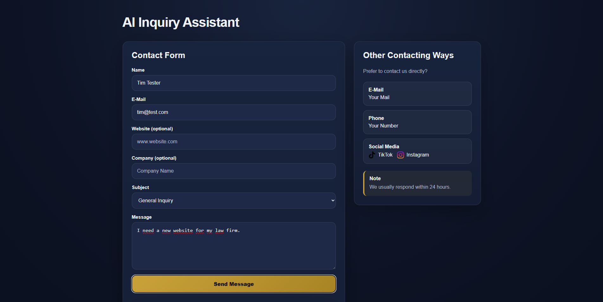
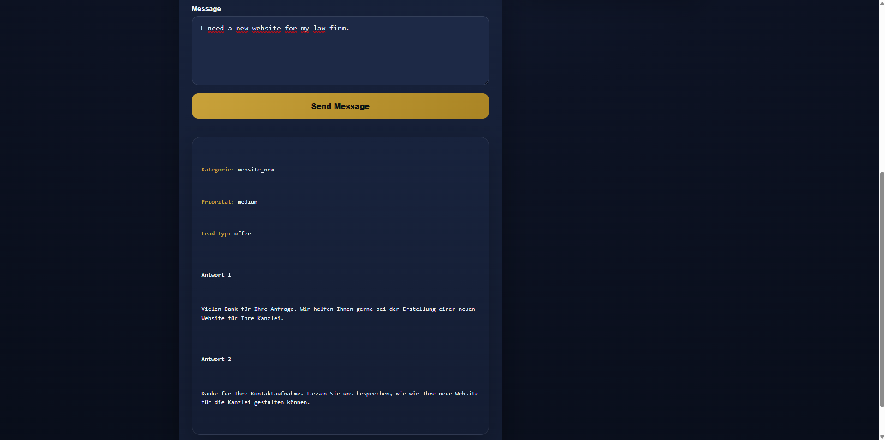

# HEVAL AI Inquiry Assistant (deutsche Version unten)

A web-based tool to classify and structure incoming contact inquiries using AI.

Built as part of HEVAL – IT Services & Automation.

---

## Preview

Form submission with AI classification result:





---

## What this does

The user submits a contact request via the form.

The system:
1. validates the input
2. sends the request to the backend
3. classifies it using AI
4. returns:
   - category
   - priority
   - lead type
   - 2 reply suggestions

The current implementation displays the result in the UI.

The architecture allows easy extension, for example:
- storing requests in a database
- forwarding leads via email or CRM
- triggering automated workflows

---

## Features

- Contact form (frontend)
- Input validation (frontend + backend)
- AI-based classification:
  - category
  - priority
  - lead type
- Generates 2 structured reply options (German)
- Clear UI states:
  - loading
  - error
  - result display

---

## Tech Stack

- Frontend: HTML, CSS, JavaScript
- Backend: Node.js, Express
- AI: OpenAI API

---

## Project Structure

```
/frontend
  index.html
  script.js
  style.css
  /images

server.js
package.json
.env.example
.gitignore
```

---

## Setup

### 1. Clone repository

```bash
git clone https://github.com/Cangir117/heval-ai-inquiry-assistant.git
cd heval-ai-inquiry-assistant
```

### 2. Install dependencies

```bash
npm install
```

### 3. Setup environment variables

Create a `.env` file in the root:

```env
OPENAI_API_KEY=your_openai_api_key_here
```

### 4. Start backend

```bash
node server.js
```

Server runs on:
http://localhost:3000

### 5. Start frontend

Open the frontend using a local server (required due to browser security):

Example (VS Code Live Server):
http://127.0.0.1:5500/frontend/index.html

---

## Important Notes

- `.env` is not included for security reasons
- You must use your own OpenAI API key
- Opening the HTML file via `file://` will not work (CORS restrictions)

---

## Purpose

This project demonstrates:

- Fullstack setup (frontend + backend)
- API integration
- Input validation and basic security practices
- Structured AI output handling

---

## Image Credits

Some icons used in this project are provided by Flaticon:

- TikTok icon by Freepik – https://www.flaticon.com
- Instagram icon by Freepik – https://www.flaticon.com

These assets are used under a valid license.

---

# Deutsche Version

## Beschreibung

Ein webbasiertes Tool zur Klassifizierung und Strukturierung von eingehenden Kontaktanfragen mithilfe von KI.

Entwickelt im Rahmen von HEVAL – IT Services & Automation.

---

## Funktionen

- Kontaktformular (Frontend)
- Eingabevalidierung (Frontend + Backend)
- KI-basierte Klassifizierung:
  - Kategorie
  - Priorität
  - Lead-Typ
- Generierung von 2 Antwortvorschlägen (auf Deutsch)
- Klare UI-Zustände:
  - Laden
  - Fehler
  - Ergebnisanzeige

---

## Technologien

- Frontend: HTML, CSS, JavaScript
- Backend: Node.js, Express
- KI: OpenAI API

---

## Projektstruktur

```
/frontend
  index.html
  script.js
  style.css
  /images

server.js
package.json
.env.example
.gitignore
```

---

## Einrichtung

### 1. Repository klonen

```bash
git clone https://github.com/Cangir117/heval-ai-inquiry-assistant.git
cd heval-ai-inquiry-assistant
```

### 2. Abhängigkeiten installieren

```bash
npm install
```

### 3. Umgebungsvariablen einrichten

Erstelle eine `.env` Datei im Hauptverzeichnis:

```env
OPENAI_API_KEY=dein_openai_api_key
```

---

### 4. Backend starten

```bash
node server.js
```

Server läuft unter:
http://localhost:3000

---

### 5. Frontend starten

Öffne das Frontend über einen lokalen Server (aufgrund von Browser-Sicherheitsrichtlinien erforderlich):

Beispiel (VS Code Live Server):
http://127.0.0.1:5500/frontend/index.html

---

## Wichtige Hinweise

- `.env` ist aus Sicherheitsgründen nicht enthalten
- Es muss ein eigener OpenAI API Key verwendet werden
- Das Öffnen der HTML-Datei über `file://` funktioniert nicht (CORS-Sicherheitsbeschränkungen)

---

## Zweck

Dieses Projekt demonstriert:

- Fullstack-Entwicklung (Frontend + Backend)
- API-Integration
- Eingabevalidierung und grundlegende Sicherheitsmaßnahmen
- Strukturierte Verarbeitung von KI-Ausgaben

---

## Autor

Cangir Ali  
HEVAL – IT Services & Automation
